<div align="center">

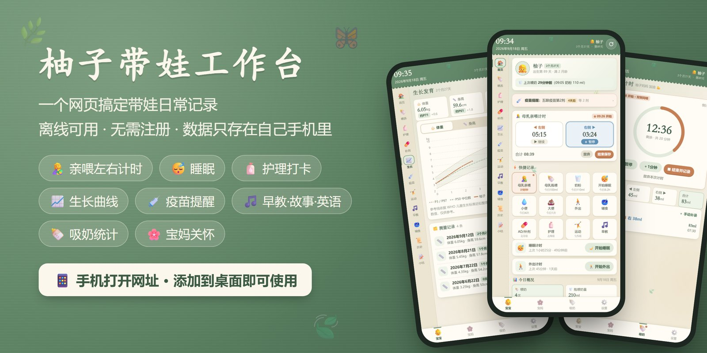

# 🌿 柚子带娃工作台

**一个网页搞定带娃日常记录：喂奶、睡眠、尿便、护理、生长、疫苗、早教、吸奶，全在手机里**

[](https://jingxuan-wh.github.io/baby-workbench/)

   

</div>

---

## 👶 这是什么

半夜抱着宝宝喂奶的时候，最需要的是：**单手一点就能记下来**，第二天还能清楚地知道「上次喂奶是几点、左边喂了多久、今天尿了几次、AD 吃了没有」。

柚子带娃工作台就是为这个场景做的。它是一个**纯网页应用**：

- 📱 手机浏览器打开，**添加到桌面**后像 App 一样全屏使用
- ✈️ 打开过一次之后**断网也能用**，地铁里、医院里都不怕
- 🔒 **不需要注册账号**，所有记录只保存在你自己的手机里，不上传任何服务器
- 🎨 复古森林绿配色，小叶子和蝴蝶在页面里慢慢飘，带娃再累也看得舒服

> 最早是给我家宝宝「柚子」做的，现在分享出来，希望也能帮到其他新手爸妈。

## ✨ 功能一览

| 分区 | 能做什么 |
|---|---|
| 🏠 **首页** | 母乳亲喂**左右侧计时**（随时切换、提示下次先喂哪侧）、瓶喂/奶粉、小便/大便一键记录、睡眠和外出计时、今日概况、时间线、距上次喂奶提醒 |
| 🍼 **喂养** | 母乳亲喂 / 母乳瓶喂 / 奶粉 / 小便 / 大便（颜色、性状，异常颜色提醒）/ 睡眠 / 外出，按日期和类型筛选 |
| 🧴 **日常护理** | 洗澡、抚触、润肤、晒太阳、游泳、剪指甲……**可多次打卡**、月历汇总、历史记录、打卡后改日期；**按月龄推荐护理**，附教程链接 |
| 💊 **补剂** | AD / D3 打卡，可自定义添加（铁剂、益生菌、DHA…），按月龄给出补充建议 |
| 📈 **生长发育** | 身高 / 体重 / 头围记录与曲线，叠加 **WHO 参考线（P3/P50/P97）**，自动估算百分位 |
| 💉 **疫苗提醒** | 国家免疫规划 + 五联方案 + 常用自费疫苗，按生日推算应种日期，逾期/临近提醒 |
| 🤸 **运动** | 每日运动打卡 + **本月龄运动推荐**（大运动/精细运动），26 个动作有**分步图文教程**和视频教程链接，30 项发育里程碑 |
| 🎵 **早教** | SSS 英文儿歌、按月龄早教活动、**22 首睡前音乐**（八音盒摇篮曲 + 白噪音，离线合成）、**每日更新的睡前故事**、**每周更新的英语口语**（32 个生活场景 256 句，内置离线发音，不依赖手机语音引擎） |
| 🥣 **辅食** | 按月龄推荐食物、性状与餐次建议、新食物排敏观察、已尝试食物清单 |
| 📜 **历史 / 小结** | 喂养 + 辅食合并查询；每日小结自动汇总，一键复制发给家人 |
| 🍼 **吸奶** | 倒计时/正计时，结束后**分别记录左右侧奶量**；日/周/月**左右两条曲线**统计 |
| 🌸 **宝妈** | 心情日记、宝妈补剂、产后恢复打卡（喝水、凯格尔…）、体重腰围曲线，还有每天一句暖心话 |
| 💾 **备份** | 一键导出 **JSON 备份** 和 **Excel 全量表格**（17 个工作表），换手机也能恢复 |

## 📸 截图

> 以下截图使用的是演示数据。

| 首页 · 亲喂左右计时 | 今日概况 · 时间线 | 喂养记录 |
|:---:|:---:|:---:|
| 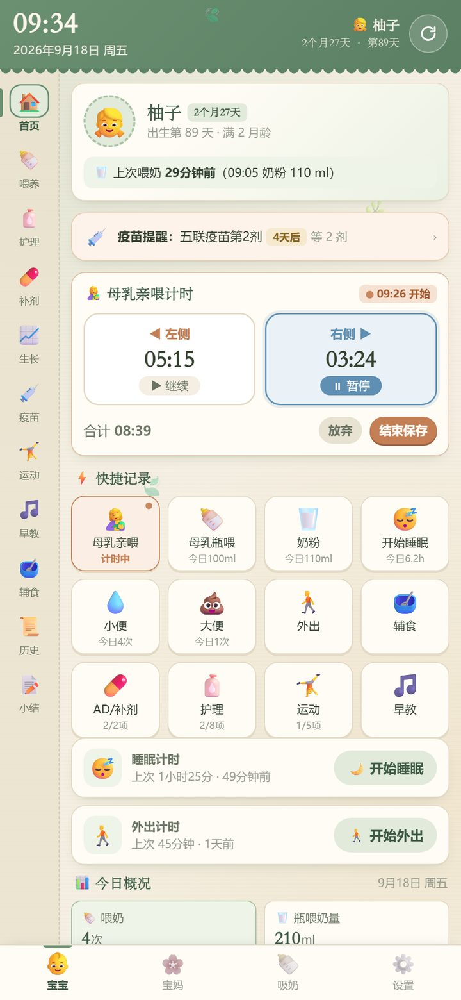 | 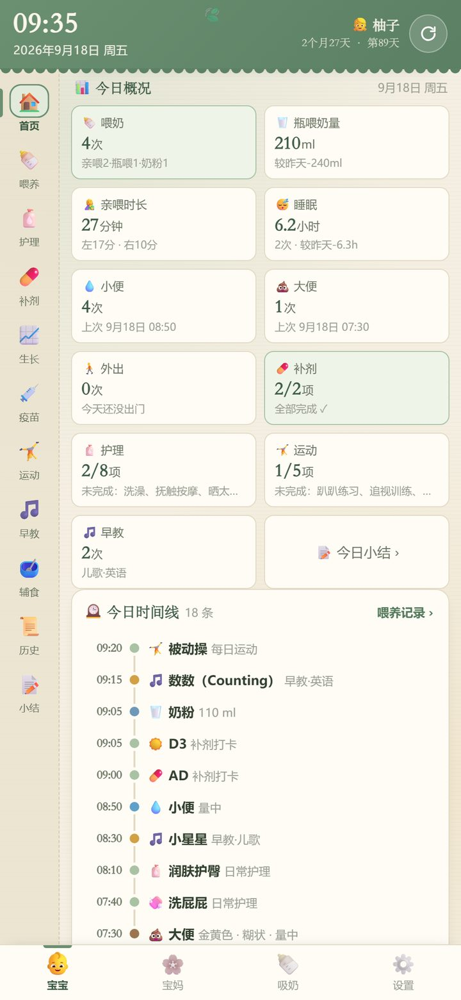 | 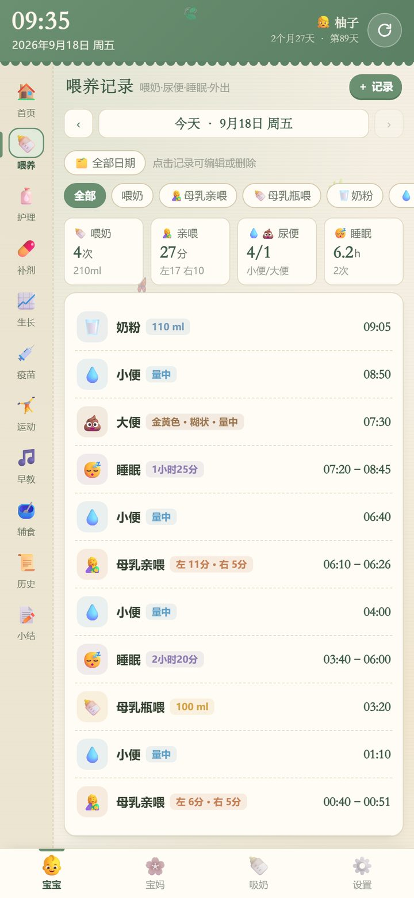 |
| **护理打卡 · 月历汇总** | **生长曲线 · WHO 参考** | **疫苗提醒** |
| 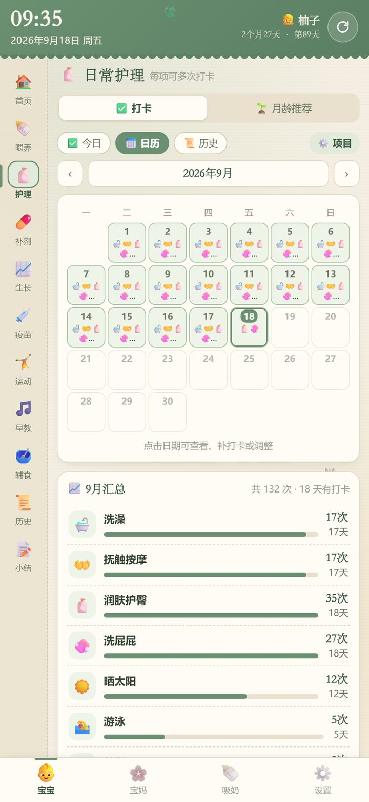 | 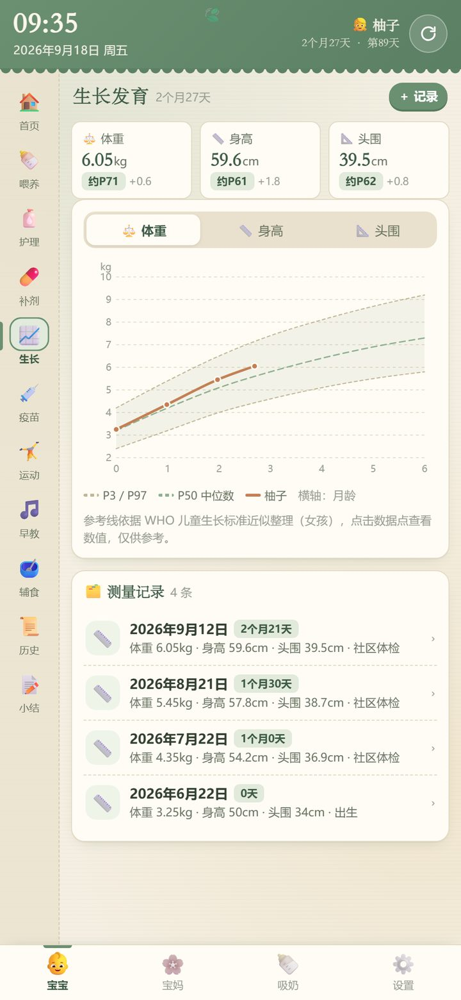 | 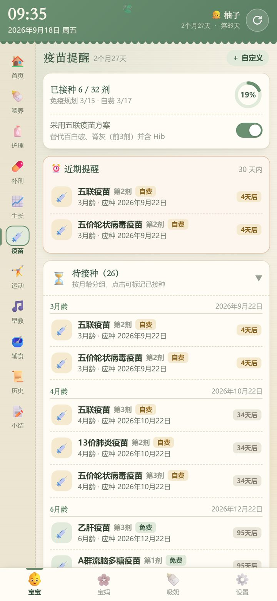 |
| **按月龄运动推荐 · 分步教程** | **英语口语 · 每周主题** | **睡前音乐 · 八音盒与白噪音** |
| 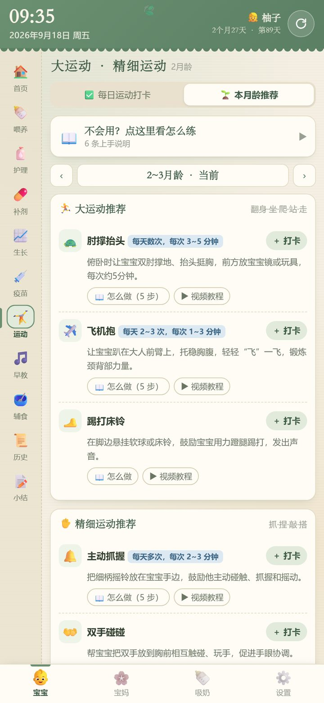 | 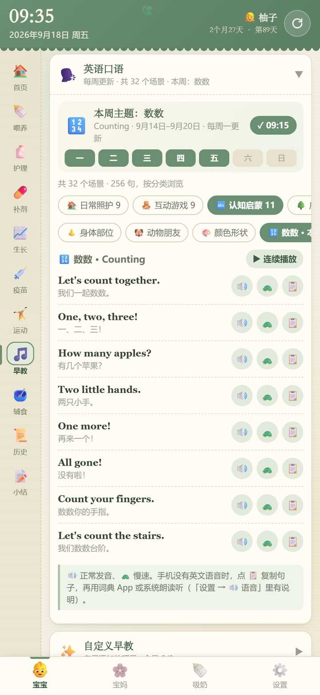 | 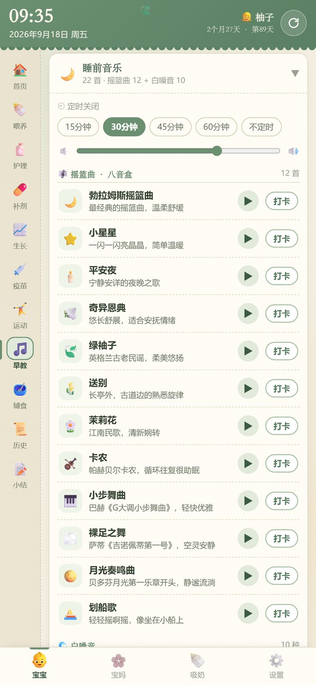 |
| **睡前故事 · 每日更新** | **吸奶计时** | **吸奶统计 · 左右曲线** |
| 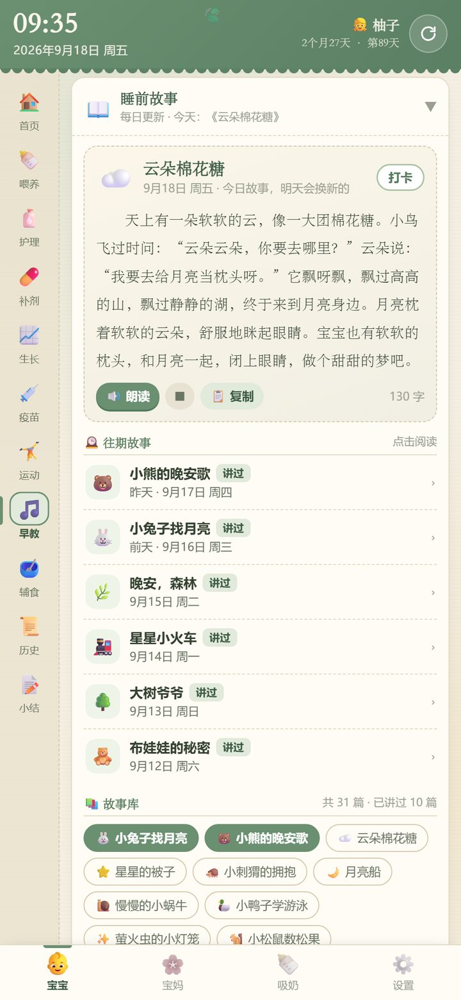 | 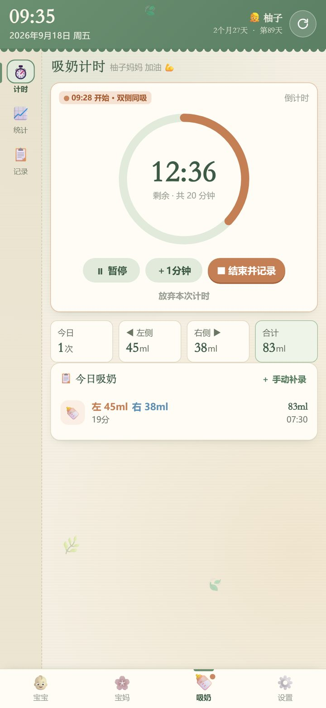 | 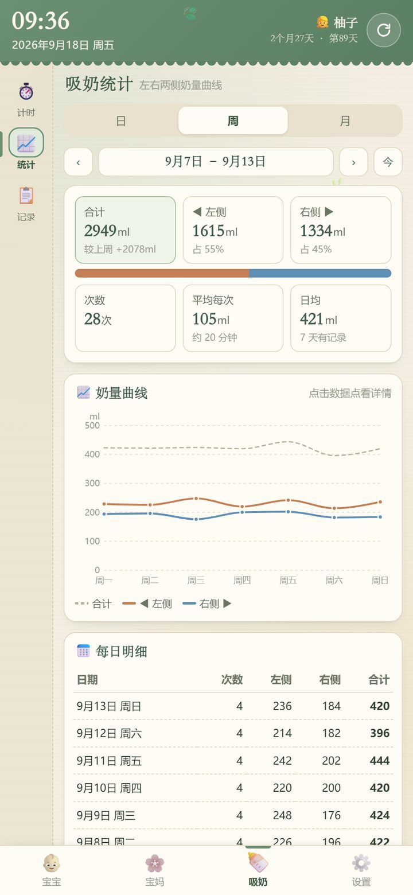 |
| **宝妈 · 今日** | **每日小结** | **内置离线语音包** |
| 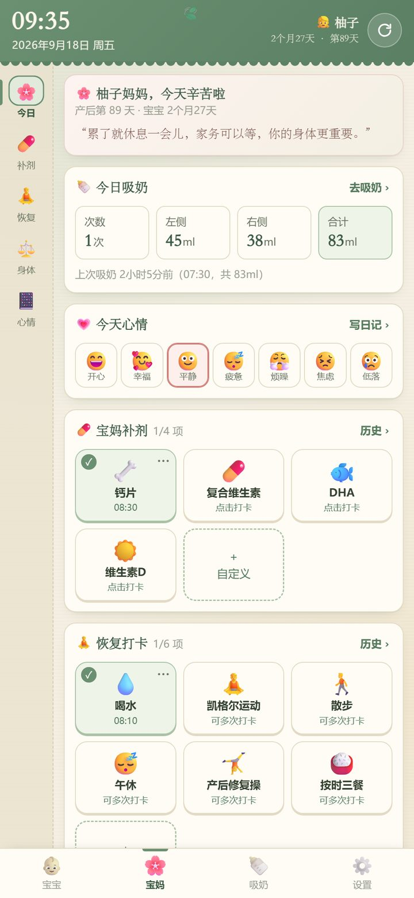 | 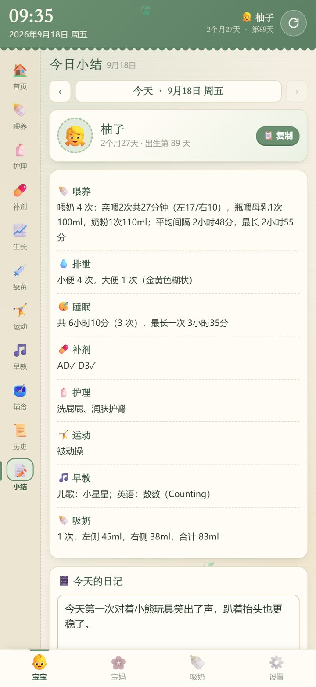 | 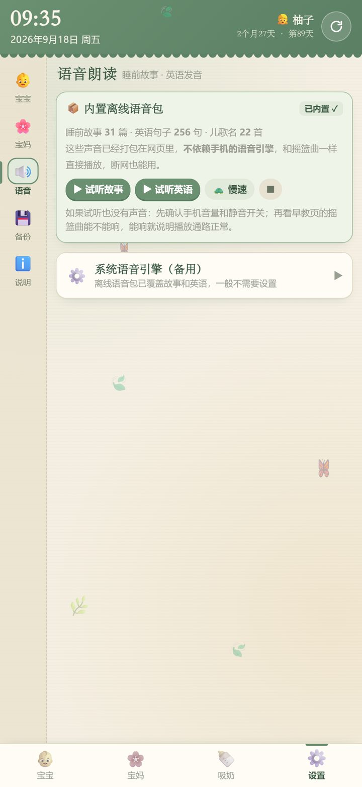 |

## 🚀 三步开始使用

<table><tr><td>

**① 用手机打开网址**

👉 **https://jingxuan-wh.github.io/baby-workbench/**

（电脑上可以直接扫右边的二维码）

**② 添加到桌面**

- **安卓 / 鸿蒙**：用 Chrome 或系统浏览器打开，点浏览器提示的「安装」，或菜单里的「添加到主屏幕 / 安装应用」
- **iPhone**：用 Safari 打开，点底部「分享」→「添加到主屏幕」

**③ 从桌面图标打开**，填写宝宝昵称和生日，就可以开始记录了。

</td><td align="center">

<br>
<sub>手机扫码打开</sub>

</td></tr></table>

> 💡 **第一次打开需要联网**（约 3 MB，服务器在境外，国内可能要等几秒）。打开过一次后就缓存在手机里，**之后断网也能用**。
>
> 💡 也可以直接下载 [`index.html`](index.html) 用浏览器打开，但用本地文件打开时，桌面图标可能会因为文件被清理而失效，**更推荐用网址打开再添加到桌面**。

## 📖 使用指南

底部四个按钮是四个大分区，左侧图标栏是分区里的各个页面：

| 底部按钮 | 左侧页面 |
|---|---|
| 👶 **宝宝** | 首页 · 喂养 · 护理 · 补剂 · 生长 · 疫苗 · 运动 · 早教 · 辅食 · 历史 · 小结 |
| 🌸 **宝妈** | 今日 · 补剂 · 恢复 · 身体 · 心情 |
| 🍼 **吸奶** | 计时 · 统计 · 记录 |
| ⚙️ **设置** | 宝宝资料 · 宝妈资料 · 语音 · 备份 · 说明 |

> 通用操作：**每条记录都可以点开修改时间、内容或删除**；删除后底部会出现「撤销」，手滑也不怕。

> 下面每一节都可以点开看详细说明 👇

<details>
<summary><b>🏠 首页：半夜单手也能记</b></summary>
<br>

- **顶部卡片**：宝宝月龄、出生第几天，以及「上次喂奶是多久以前」。超过设定的喂奶间隔（默认 3 小时）会变色提醒「该喂奶啦」。
- **亲喂左右计时**：
  1. 点「◀ 左侧」或「右侧 ▶」开始计时；
  2. 换边时直接点另一侧，左右时间分开累计；同一侧再点一下是暂停；
  3. 喂完点「结束保存」，自动记下左、右各喂了多久。
  - 开始前会根据上一次的情况**提示这次先喂哪一侧**；
  - 忘了计时？点「手动补录」直接填分钟数。
- **⚡ 快捷记录**：瓶喂、奶粉填个奶量就行；小便、大便**点一下就记好**（大便可以补充颜色和性状）；睡眠、外出点一下开始、再点一下结束，自动算时长；AD、护理、运动直接打卡。
- 宝宝睡着了才想起来没点开始？点睡眠计时右边的「⋯」→「调整开始时间」。
- 计时按开始时刻计算，**锁屏、切到别的 App、刷新页面都不会中断**。
- 往下是**今日概况**（和昨天对比）和**今日时间线**。疫苗快到期时首页会出现提醒卡片，晚上 6 点以后会出现今天的睡前故事。

</details>

<details>
<summary><b>🍼 喂养：所有喂奶和尿便记录</b></summary>
<br>

- 7 种记录：母乳亲喂、母乳瓶喂、奶粉、小便、大便、睡眠、外出。
- 可以按**日期**翻看，也可以按**类型**筛选；点任意一条修改时间、奶量、备注。
- 大便可选颜色（黄色、绿色、棕色……）和性状（糊状、有奶瓣、有泡沫……）；选到**黑色、白色/灰白、带血/红色**时会提醒及时就医。

</details>

<details>
<summary><b>🧴 护理 & 💊 补剂：打卡 + 按月龄推荐</b></summary>
<br>

- 默认护理项目：洗澡、抚触按摩、润肤护臀、洗屁屁、晒太阳、游泳、剪指甲、口腔清洁；默认补剂：AD、D3。
- **同一项一天可以打卡多次**（比如一天洗了两次屁屁）；打卡后点项目右上角的「⋯」可以**改打卡日期**或取消。
- **月历**一眼看出哪天做了、哪天漏了；点日历上的某一天可以查看或补打卡；左右切换月份查看历史。
- 「⚙️ 项目」里可以**自己添加**（铁剂、益生菌、DHA……）、改名、删除。
- 「🌱 月龄推荐」页按宝宝当前月龄列出该做的护理和该补的营养素，写明频率和做法，抚触、洗澡、剪指甲等附有**教程链接**；点「＋ 打卡」就能加入每日打卡，点「‹ ›」还能看其他月龄的推荐。

</details>

<details>
<summary><b>📈 生长 & 💉 疫苗</b></summary>
<br>

- **生长**：记录体重、身高、头围，自动画出 0~3 岁的曲线，并叠加 **WHO 儿童生长标准**（P3 / P50 / P97 三条参考线，区分男女），每次测量都会标出宝宝**大约处在第几百分位**；点曲线上的点可以看具体数值。
- **疫苗**：填好宝宝生日后，按「国家免疫规划 + 常用自费疫苗」自动排出每一剂的应种日期，分成「待接种 / 已接种」两组，可以折叠。
  - 打算打**五联疫苗**？打开「采用五联疫苗方案」开关，会自动替换掉对应的百白破、脊灰和 Hib；
  - 30 天内要打的疫苗集中显示在「近期提醒」，7 天内或已逾期的还会出现在首页；
  - 点某一剂可以标记已接种、修改实际接种日期；也可以「＋ 自定义」添加疫苗；
  - 宝宝几个月大才开始用？一键把「应种日期已过」的疫苗批量标记为已接种，再逐条修改。

</details>

<details>
<summary><b>🤸 运动：不会做？每个动作都有教程</b></summary>
<br>

- 分成**大运动**（抬头、翻身、坐、爬、站、走）和**精细运动**（追视、抓握、传递、捏取、涂鸦）两部分。
- **推荐使用顺序**：
  1. 先看「🌱 本月龄推荐」，里面是适合宝宝现在月龄的动作；
  2. 每个动作点「📖 怎么做」，有**分步骤图文教程**（频率、每一步怎么摆、注意事项），还能跳转到 B 站搜教学视频；
  3. 觉得合适就点「＋ 打卡」，加入「✅ 每日运动打卡」，每天练完点一下；
  4. 宝宝学会了某个动作，在「本阶段里程碑」点一下，记下达成日期。
- 26 个动作教程，从 0 月龄的趴趴抬头到 2 岁的双脚跳；30 项发育里程碑，每项标注一般在几个月达成。
- 练习原则：宝宝清醒、情绪好、吃奶 1 小时后；每次几分钟，宁少勿多；全程大人看护。

</details>

<details>
<summary><b>🎵 早教：儿歌、音乐、故事、英语</b></summary>
<br>

| 板块 | 内容 |
|---|---|
| 🎵 **SSS 儿歌** | 22 首 Super Simple Songs 经典英文儿歌，按适合月龄排序，附互动玩法小贴士 |
| 🧩 **早教活动** | 0~3 岁分 7 个阶段，每阶段都有语言、视觉、听觉、情感、认知、社交等方面的亲子小游戏 |
| 🌙 **睡前音乐** | 12 首八音盒摇篮曲（勃拉姆斯摇篮曲、小星星、卡农、月光奏鸣曲……）+ 10 种白噪音（雨声、海浪、子宫心跳、嘘嘘声、吹风机……），**全部在手机上实时合成，不耗流量、断网能放**；可以定时自动关闭，切到其他页面也有迷你播放器 |
| 📖 **睡前故事** | 31 篇原创温柔小故事，**每天自动换一篇**，可以自己读，也可以点「朗读」 |
| 🗣️ **英语口语** | 32 个生活场景（起床、换尿布、洗澡、外出、看医生……）共 256 句亲子英语，**每周自动换一个主题**；每句都能点击发音，支持慢速 |
| ✨ **自定义早教** | 亲子共读、认知卡片……自己添加想坚持的项目，每天打卡 |

> 🔊 故事和英语的发音已经**打包在网页里**（离线语音包），不依赖手机自带的语音引擎，安卓、鸿蒙、iPhone 都能直接出声。

</details>

<details>
<summary><b>🥣 辅食：按月龄吃什么、怎么加</b></summary>
<br>

- 从「0~6 月龄暂不添加」到「2~3 岁规律三餐」共 8 个阶段，每个阶段写明**性状**（泥糊 → 碎末 → 手指食物 → 软块）、**每天几餐**、**推荐食物**和注意事项。
- 列出 1 岁前不能吃的食物、容易噎住的食物和常见易过敏食物，心里有数。
- 记录每次辅食吃了什么、吃了多少，标记宝宝的反应：😋 喜欢 / 🙂 一般 / 🙅 拒绝 / ⚠️ 过敏或不适。
- **新食物排敏观察**：第一次吃的食物会标记「排敏观察中」，提醒观察 2~3 天；「✅ 已尝试」自动汇总吃过的所有食物，过敏或不适的单独标出来。

</details>

<details>
<summary><b>📜 历史 & 📝 小结</b></summary>
<br>

- **历史**：喂养、辅食记录合并在一起，可以按「今天 / 近 3 天 / 近 7 天 / 近 30 天 / 全部 / 自定义日期」和记录类型筛选，并统计次数和奶量。
- **小结**：自动把一天的喂养、排泄、睡眠、外出、辅食、补剂、护理、运动、早教、里程碑、生长、疫苗、吸奶整理成一段文字，还可以写当天的日记；点「复制」就能**直接发到家庭群**给爷爷奶奶看。

</details>

<details>
<summary><b>🍼 吸奶：计时 + 左右奶量 + 曲线</b></summary>
<br>

1. 选择**倒计时**（10 / 15 / 20 / 25 / 30 / 40 分钟或自定义）或**正计时**；
2. 选择「双侧同吸 / 只吸左侧 / 只吸右侧」，点开始；
3. 时间到（或点结束）会弹出记录框，**分别填写左侧、右侧各吸了多少 ml**。

- 「📈 统计」按**日 / 周 / 月**查看，左右两侧各一条曲线，还有合计、左右占比、次数、平均每次、日均和每日明细表，并和上一周期对比；
- 「📋 记录」查看、修改所有吸奶记录，漏记了可以手动补录。

</details>

<details>
<summary><b>🌸 宝妈：也要好好照顾自己</b></summary>
<br>

- **今日**：每天一句暖心话；今天的吸奶量、心情、补剂和恢复打卡都在一页上。
- **补剂**：钙片、复合维生素、DHA、维生素 D，可以自己增减。
- **恢复**：喝水、凯格尔运动、散步、午休、产后修复操、按时三餐，**可以一天打卡多次**（比如喝水 8 杯）。
- **身体**：体重、腰围记录和曲线，看得见产后恢复的进度。
- **心情**：7 种心情 + 心情日记，点日历上的日期查看或补写。

</details>

<details>
<summary><b>⚙️ 设置与备份</b></summary>
<br>

- **宝宝 / 宝妈资料**：昵称、头像、生日、性别（影响生长参考线）、喂奶提醒间隔、默认吸奶时长等。
- **语音**：试听离线语音包，可以切换慢速。
- **备份**：
  - ⬇️ **导出 JSON 备份文件**：完整备份，用于换手机、恢复数据；
  - 📊 **导出 Excel 全量表格**：17 个工作表，适合电脑上查看、打印或给医生看；
  - 📂 **从文件导入 / 📝 粘贴导入**：从 JSON 备份恢复；
  - 记录多了又很久没备份时，首页会提醒你导出一份。

</details>

## 🔒 数据与隐私

- **不需要注册账号，没有服务器，没有统计代码，没有广告。**
- 所有记录只保存在当前手机浏览器的本地存储里，不会上传到任何地方，别人（包括作者）都看不到。
- 正因为数据只在你手机上：**清除浏览器数据、卸载浏览器会让记录丢失**，请养成定期「导出 JSON 备份」的习惯（首页会在需要时提醒你）。
- 不同浏览器之间的数据不互通，请一直用**同一个浏览器 / 同一个桌面图标**打开。

## ❓ 常见问题

<details>
<summary><b>添加到桌面的图标，过一段时间就打不开了？</b></summary>
<br>

这是用「本地 HTML 文件」添加到桌面时的常见问题：桌面图标只记住了文件的临时位置，文件被清理、移动或权限过期后就失效了。

**解决办法**：用网址 **https://jingxuan-wh.github.io/baby-workbench/** 打开，再「添加到主屏幕 / 安装应用」。这样添加的图标是一个真正的网页应用，不依赖任何本地文件，断网也能打开。

</details>

<details>
<summary><b>睡前故事、英语没有声音？</b></summary>
<br>

1. 先检查手机**媒体音量**和**静音开关**（iPhone 侧边的静音键会让网页没声音）；
2. 到「设置 → 语音」点「▶ 试听故事」「▶ 试听英语」；
3. 如果摇篮曲有声音、语音没有，可能手机里还是旧版本，联网状态下把工作台关掉再重新打开一两次，就会自动更新到最新版。

现在的版本已经把语音**打包在网页里**，不依赖手机自带的语音引擎，安卓、鸿蒙、iPhone 都能播放。

</details>

<details>
<summary><b>换手机了，或者爸爸妈妈两个人都想记，怎么办？</b></summary>
<br>

- **换手机**：旧手机「设置 → 备份 → 导出 JSON 备份文件」→ 通过微信、QQ 或数据线发到新手机 → 新手机打开工作台 →「备份 → 从文件导入」。
- **两个人记录**：目前没有云同步（这也是数据绝对私密的原因）。可以一个人把备份发给另一个人，导入时选择「**合并导入**」，两边的记录会合在一起。

</details>

<details>
<summary><b>在微信里打开可以吗？</b></summary>
<br>

不建议。微信内置浏览器可能清理网页数据、也无法下载备份文件。请点右上角「⋯」→「在浏览器打开」，再添加到桌面。

</details>

<details>
<summary><b>国内打开很慢？</b></summary>
<br>

网页放在 GitHub Pages，服务器在境外，**第一次**加载约 3 MB 可能要等几秒到几十秒。加载完成后就缓存在手机里，之后打开基本是秒开，也不再需要网络。如果实在打不开，可以下载本仓库的 [`index.html`](index.html) 用浏览器打开。

</details>

<details>
<summary><b>计时的时候锁屏、切到别的 App，会不会停？</b></summary>
<br>

不会。计时是按「开始时刻」计算的，锁屏、切后台、甚至刷新页面，回来时间都是对的。唯一的限制是：网页在后台时，手机系统可能不让它发出声音或震动，所以吸奶倒计时到点时如果在后台，回到页面会立刻弹出记录框。

</details>

<details>
<summary><b>工作台更新了新功能，怎么获取？</b></summary>
<br>

不用做任何事。联网打开时会在后台自动下载新版本，**下次打开**就是新版了，已有的记录不受影响。

</details>

## 🛠️ 技术实现

写给感兴趣的开发者朋友：

- **一个 HTML 文件**（约 3 MB），原生 JavaScript + CSS，**没有任何框架和第三方库**，不需要构建，双击就能跑。
- 数据保存在 `localStorage`；JSON 备份支持覆盖导入和合并导入。
- **Excel 导出**：手写 ZIP 打包 + OpenXML 生成真正的 `.xlsx`（17 个工作表），不依赖 SheetJS。
- **曲线图**：手写 SVG（生长曲线 + WHO 参考线、吸奶左右曲线、宝妈体重腰围）。
- **声音**：
  - 八音盒摇篮曲和 10 种白噪音全部用 **Web Audio API 实时合成**，没有音频文件；
  - 睡前故事和英语句子是 309 段预先合成的语音（Ogg Opus，约 27 分钟），以 Base64 内嵌在页面里，用 Web Audio 解码播放；英语慢速用 WSOLA 算法**变速不变调**。
- **PWA**：Web App Manifest + Service Worker，支持安装到桌面、完全离线运行、后台自动更新。
- 部署在 **GitHub Pages**，没有后端。

```
├── index.html               # 工作台本体（全部功能都在这一个文件里）
├── README.md                # 就是你正在看的说明
├── sw.js                    # Service Worker：离线缓存 + 自动更新
├── manifest.webmanifest     # 桌面图标、名称、主题色
├── icon-*.png / apple-touch-icon.png
└── screenshots/             # README 截图
```

## ⚠️ 免责声明

本工具中的喂养、辅食、护理、补剂、运动、早教、生长参考值和疫苗程序等内容**仅供育儿参考，不能替代医生的专业建议**，疫苗接种请以当地接种门诊的通知为准。

宝宝出现发热（3 个月内体温 ≥ 38℃）、精神差、拒奶、呼吸急促、持续呕吐腹泻、黑便或血便等情况，请及时就医。

## 💬 反馈与支持

- 🐛 遇到问题、有新功能想法？欢迎在 [Issues](https://github.com/Jingxuan-WH/baby-workbench/issues) 里留言。
- 👍 如果它帮到了你，请点右上角的 **⭐ Star**，也欢迎分享给身边的新手爸妈 —— 这是对作者最大的鼓励。

<div align="center">

<br>

🌿🍃🦋

**愿每一天都被温柔记录**

<sub>献给柚子，也献给每一位熬夜带娃的爸爸妈妈</sub>

</div>
